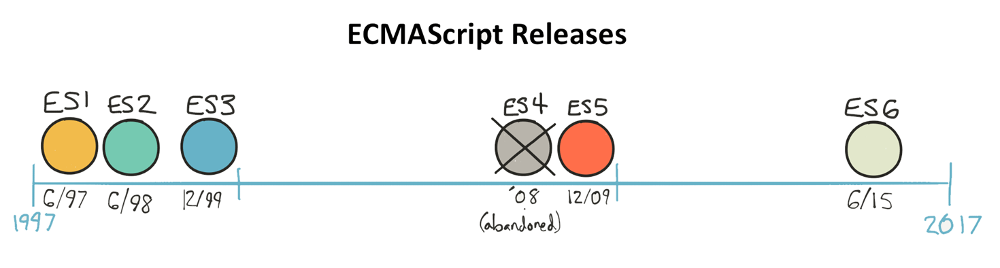
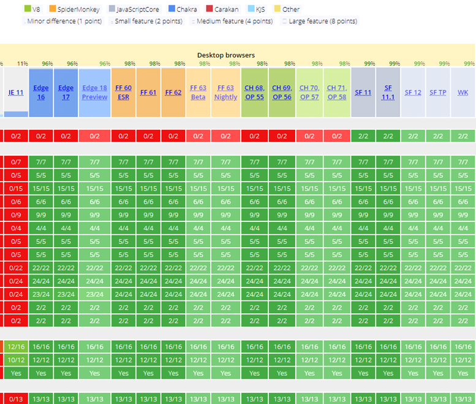

# Preamble

ECMAScript, TC39 and versions of JavaScript

## ECMAScript

**ECMA International** is an organization creating standards for technologies

**ECMAScript** is the name of the referenced specification _ECMA-262_ and describing a versatile scripting language

**JavaScript** is a versatile scripting language and the most popular implementation of ECMAScript (another popular implementation is ActionScript)

**V8**, **Rhino**, **Chakra** are JavaScript engines: interpreters that are able to compile and execute JavaScript code

## TC39 (Technical Commitee 39)

TC39 is the name of the technical committee deciding on the evolution of the ECMAScript specification.

It is composed of delegates from **large companies** (including all major browser vendors) and **invited experts**.

It **operates by consensus**: the decision is made if the majority agrees and no one vetoes.

The concerned parties are **obliged to implement** the changes voted.

### 5 steps for a TC39 proposal

- **0: Strawman** - suggestion of a need, call for ideas
- **1: Proposal** - draft solution, first polyfills / demos
- **2: Draft** - precisely describes the syntax / API
- **3: Candidate** - signed by the whole committee, call for implementations
- **4: Finished** - ready to be included in the next release of ES

::: warning
Any proposal before the stage 4 can be completely abandoned.
However, starting from stage 3, the level of confidence is quite high.
:::

## ECMAScript Versions

A long delay between initial draft and release involves many browser-specific implementations

Therefore, TC39 decided to move to a yearly release planning, starting from ES6 (renamed **ES2015**).

### Yearly releases of ECMAScript

- ES2015 aka ES6 - June 2015 ; **major evolution**
- ES2016 - June 2016 ; 2 new features
- ES2017 - June 2017 ; 5 new features
- ES2018 - June 2018 ; 3 new features

### Browser implementations

As a result of the new yearly release rate: an excellent support, exhaustive and homogeneous between all modern browsers (aka _evergreen browers_)

